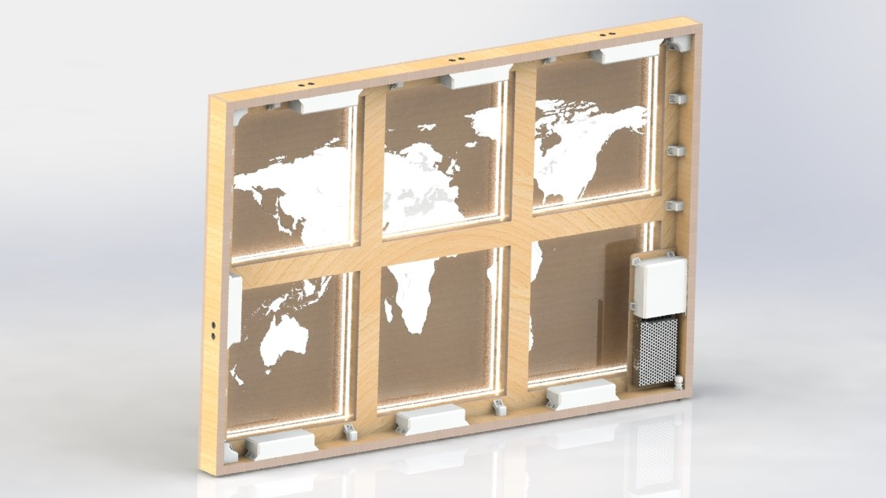

   

# World Map with Motion Sensing Panels

This was my final project for Fab Academy in 2022. You can find the page in its original context [here](https://fabacademy.org/2022/labs/kamplintfort/students/aaron-hinkle/Final_Project/Final_Project.html).This document comprehensively covers the design and fabrication processes and the accompanying links lead to all of the files necessary to recreate the project for one's self. While reading, please keep in mind that I was actually learning these technologies during these projects, and this page was more about documenting that learning process than about presenting the world map as a developed product. Inspired by others in the Fab-network, all of the design files are open source and all of the documentation of my processes and problems is freely available for any who are interested. For this purpose, I distribute the files under the same Creative Commons license for which it was first published. It is my hope that the open source philosophy will inspire others to move beyond the intellectual property paradigm and allow good ideas to be developed by good people.

## Hero Shots

#### Summary Slide

#### Description

#### Hero Video

## Initial Concept

*   Large world-map split into six panels (2 x 3 arrangement) on a single backplate
*   Backplate is actually a shallow shadow box to hide the electronic components in the depth dimension
*   Each panel has its portion of the map cut out using a CNC mill (or possibly a laser cutter)
*   Space routed out underneath to add LEDs around the perimeter(s) / Panels could also be shallow shadow boxes with lights behind (this would add more visual depth as well as physical depth)
*   LEDs defining the perimeters of continents can be turned on independently
*   Frame and panels made from hard plywood (either with a nice veneer, or painted)
*   No visible fasteners (everything glued and screwed from behind)
*   No visible electronics (all wires and circuit boards properly managed and routed using 3D printed parts behind backplate)
*   Under 40 kg so it can be hung on a wall (some clever way of keeping it there safely)
*   Soft "feet" so accidental movement will not damage the wall
  

### Maybes:

*   If it looks good (and if it's even possible \[CAD file?\]), topography could be relief cut into the backplate behind the outlines
*   If not topography, then maybe stencils or stickers showing geological features
*   Ideally battery-powered to avoid a hanging cord
*   Possibly add LEDs for countries/ major cities/ mountain ranges/ etc. depending on difficulty of programming and electronics
    
    ### Conceptual Images
    
    
    
    This is a quick CAD model I made up in SolidWorks. The lighting options and/ or my rendering skills aren't good enough to make it look perfect, but I think the idea comes through. You can't really tell, but the LED chain is white in this image.
    
    
    
    I will need to put a lot of thought into electronics and some kind of input device, which are not shown in this model, but at least here you can see the effect of using a different color (blue now) for the LED chains around the continents.
    
      
    
    ## Project Timeline
    
      
    
    ## Detailed CAD Design
    
    I used a little hand drawing on notebook paper to rough out the basic shape and dimensions based off of what I could get out of a single sheet of plywood (125 cm x 250 cm). From there, I made the conceptual design that you see above. However, that was just a single solid part with some extrusions and cuts. Now it's time to turn this concept into a CAD assembly that can actually be built.
    
    ### Working in SolidWorks
    
    #### Dog Bones
    
    
    
    Dog bones can be nice in some designs, but I really wanted to avoid them in this one. However, they exist for a reason. To get around the square corner issue, I had to be a bit creative. I decided to use a combination of half lap and cross lap joints so all the dog bones would be hidden. This had a few other positive effects as well:
    
    #### Overlap
    
    
    
    First, it would allow for a stronger joint since now there would be glue between multiple surfaces in multiple dimensions; second, it would be fairly easy to machine since tolerances could be relaxed a bit; and most importantly for the aesthetic, it would cover up the chip-out from our up-cut tools in the lab.
    
    #### Small Frames
    
    
    
    I designed the panels for the map so they could be assembled and installed individually into the bigger frame.
    
    #### Big Frame
    
    
    
    And I designed the big frame to be assembled by itself. Keeping the parts separate will help later when installing lights, electronics and whatever I decide to do about the land-part of the map.
    
    #### Full Assembly
    
    
    
    When assembled, every joint has one full centimeter of overlap so most of the manufacturing "crimes" should be hidden in the end.
    
    #### File Downloads for the Initial CAD Design
    
    *   [Backplate CAD](Media/Files/Backplate.SLDPRT)
    *   [Top and Bottom of Outer Frame CAD](Media/Files/Big_Top_and_Bottom.SLDPRT)
    *   [Sides of Outer Frame CAD](Media/Files/Big_Sides.SLDPRT)
    *   [Top and Bottom of Small Frames CAD](Media/Files/Small_Tops_and_Bottoms.SLDPRT)
    *   [Sides of Small Frames](Media/Files/Small_Sides.SLDPRT)
    *   [CAD Assembly](Media/Files/World_Map_Assembly.SLDASM)
      
      
    *   I also made an appearance file for SolidWorks since there was nothing suitable in the library for the sides of multiplex plywood. I used [this](https://t4.ftcdn.net/jpg/01/91/39/43/360_F_191394350_0MOHfIdfm9QTUtYdowF8UflgSK9CfF4W.jpg) jpg image to create [this](Media/Files/multiplex plywood side.p2m) .P2M file. If you would like to learn how to do this, check out my page for [computer aided design week](https://fabacademy.org/2022/labs/kamplintfort/students/aaron-hinkle/Weekly_Projects/02_Computer_Aided_Design/Computer_Aided_Design.html).
    
      
    
    #### CAD Render of Assembled Frames
    
      
      
    
    ## Manufacturing the Frame
    
    [Computer controlled machining week](https://fabacademy.org/2022/labs/kamplintfort/students/aaron-hinkle/Weekly_Projects/07_Computer_Controlled_Machining/Computer_Controlled_Machining.html) lent itself very nicely to my design. From the very beginning, I have been planning to make it from a single sheet of plywood and to make the longest dimension 1.25 meters (the width of plywood sheets in Germany), so I got lucky. I wrote up the whole CAM and machining process much more comprehensively there, so I will be brief here.
    
    ### Building the CAM
    
    #### CAM
    
    
    
    I created the CAM in Fusion 360. This project is machinable with a single 6 mm end mill and two 2D milling operations (Pocket Cut and Contour). By far the most difficult part of this CAM was figuring out how I could cut an 84.5 cm part on a CNC machine with an 80 cm cutting distance. That was a trick that took some doing.
    
    #### CNC Milling
    
    
    
    The set-ups took a while and the quality and waste left me frustrated for a few of the parts, but overall the machining went well. Most machining damage was easily fixed with some sand paper and the patient application of elbow grease.
    
    #### Glue-up and Assembly
    
    
    
    Glue up went without a hitch. I weighed everything down with clamps, straps and heavy bits from around the lab and it all held together nicely. Even so, I still went back in afterward and shoved more wood glue anywhere I could find any cracks as well as running a bead along all of the inside seems.
    
      
    
    #### File Downloads for Machining the Frame
    
    *   [CAM for Outer Frame Parts](Media/Files/Big_Frame_New_Parameters.nc)
    *   [CAM for Faces of Small Frame Parts](Media/Files/Small_Frame_New_Parameters.nc)
    *   [CAM for Back of the Top and Bottom of the Small Frames](Media/Files/Short_Face_CAM.nc)
    *   [CAM for Backs of the Sides of the Small Frames](Media/Files/Long_Face_CAM.nc)
    *   [CAM for Backplate](Media/Files/Backplate_Cam.nc)
    
    #### Final Frame Assembly
    
    
    
      
      
    
    ## Main Electronics Board
    
    I wrote the pseudo code for what I wanted the electronics to do, at least for the final spiral. I want seven ultrasonic sensors: a main power sensor, and a sensor for each of the six LED chains.  
    if sensor\_pow is triggered  
    turn on all LED chains  
    while sensor\_pow is triggered  
    if sensor\_i is triggered  
    change the state of the LED chain corresponding to the sensor that is triggered  
    end  
    end  
    end  
    This should allow you to turn on my whole map with one swipe of the hand, and then independently actuate the six different panels with the other six sensors. It seems so simple, right? After talking to my instructor, I know I will basically just need an Arduino Uno or equivalent, so I set out to make my own version of the [Satshakit](https://github.com/satshakit/satshakit). Originally designed by [Daniele Ingrassia](http://satshakit.com/), the Satshakit, is an open source board that is 100% compatible with the Arduino IDE and libraries. I designed it during the [electronics design](https://fabacademy.org/2022/labs/kamplintfort/students/aaron-hinkle/Weekly_Projects/06_Electronics_Design/Electronics_Design.html) week and once again, most of the documentation for this part of the project can be found there.
    
    ### Board Design in KiCAD
    
    #### Schematic
    
    
    
    I designed the board based on Daniele's schematic, but I also needed to add at least one button and one LED to satisfy the requirements of the assignment that week, so I decided to add a single button to serve as a test for my main power sensor, and then added six LEDs, each corresponding to the pins where I would eventually connect my LED chains for the map panels. These would not be necessary for reproducing the map.
    
    #### Blueprint
    
    
    
    Routing this board took me a very long time. It's the first board I ever designed, and even though I had some help from Daniele's blueprint, my own configuration came out quite different thanks to my additions. On top of that, I forgot how to add a GND pool, so even all the grounded pins are connected with traces. I am proud that I got this board to work for my first one ever, but I would do a much better job with it in the future if I was trying to reproduce the map.
    
    ### Milling and Populating
    
    #### Loving the Genmitsu
    
    
    
    To cut the board, I got back on the Genmitsu (now affectionately referred to around the lab as "Genny"). This was the second board I had cut on it and once again, everything went smoothly for me. I really can't believe the quality of the cut for a couple hundred bucks. To me, it's honestly comparable to the the Roland sitting next to it for five or six times the price.
    
    #### Soldered
    
    
    
    I had to correct a couple mistakes, but in the end, I got everything soldered together and tested all the connections for continuity where it should be and a lack thereof where it shouldn't. Again, I am no expert, but even despite the mistakes, I thought it came out looking pretty fancy. I was proud of it.
    
    #### Pinout
    
    
    
    #### File Downloads for My Satshakit Design
    
    *   [KiCad Project File](Media/Files/atMega328p_Arduino.zip)
    *   [SVG file for Circuit](Media/Files/atMega328p_Arduino-F_Cu.svg)
    *   [Traces PNG](Media/Files/traces.png)
    *   [Drills PNG](Media/Files/drills.png)
    *   [Cutout PNG](Media/Files/cutout.png)
    *   [Traces G-code](Media/Files/tracesanddrills.png.nc)
    *   [Cutout G-code](Media/Files/cutout.png.nc)
    
      
      
    
    ## Alterations to the Frame
    
    #### HC-SR04 CAD Model
    
    
    
    I started with a quick search on [GrabCAD](https://grabcad.com/library/) for a model of my ultrasonic sensor. Fortunately, the HC-SR04 is a very popular sensor, so there were a few from which I could choose, and [one of them](https://grabcad.com/library/hc-sr04-capteur-obstacle-1/details?folder_id=10872439) was particularly nice. Using the model, I was able to get all the relevant dimensions. This made the alterations to the frame, much easier to plan and execute since it was easier to make some jigs.
    
    #### Jig for Router
    
    
    
    These pockets would have been easy to cut with the CNC machine, but unfortunately, my frame was already glued up, so I had to get creative about how I would add the pockets for the sensors. I built a jig for the router and then used a bunch of clamps to hold it and the frame in place. Then I used a 8 x 80mm end mill on the router to cut the pockets.
    
    #### Jig for Drill
    
    
    
    Once the pockets were cut, it was time to think about the holes for the transmitters and receivers. I made another small jig that allowed me to locate the holes relative to the new slots I had cut. This process was a bit janky and was done with analog hand tools, but it worked remarkably well overall.
    
    #### Final Result
    
    
    
    They came out looking pretty good in the end. It added about a day of labor to make the jigs and to cut the pockets and holes, but I really like the almost flush look they have now and I am sure that the narrow holes will not interfere with the sensing.
    
      
      
    
    ## Full Final Circuit
    
    #### Circuit with Pin Connections
    
    
    
    Here is the final circuit showing all of the components and their respective pins. One thing worth noting is that the main power MOSFET is on a PWM pin. Thus, a future spiral could be to add a dimming function to the map. The brightness could even be adjusted according to the distance your hand is from the sensor when you turn it on.
    
    #### Circuit Showing Physical Placement of Components
    
    
    
    Although the full logical schematic was useful, I wasn't smart enough to be able to think about the entire map layout using the logic alone, so I had to create a second schematic showing the actual physical layout of the components and wires.
    
    #### Breakout Boards
    
    
    
    Once I had the physical placement of the circuit worked out, I made some small breakout boards to hold the MOSFETs and their resistors. Six of the boards are identical and one of them also holds the voltage regulator for the smaller circuits. These are very simple boards with big fat traces (1.4 mm) so there was basically no chance of cutting them wrong.
    
    #### Easy Soldering
    
    
    
    I got them all soldered up without any problems (loving my big fat traces lol). I think the only thing I would change next time is to not have the Roland mill the bolt holes for mounting the boards. It doesn't matter in this case, but it did not do a very nice job and some of the holes would have to be recut if the boards were to be visible. They came out ok overall and I was ready to lay everything out into the final circuit.
    
    #### Collecting Materials
    
    
    
    I started by laying out all of my materials and components inside the map frame. I carefully cut the wires to length and then set about soldering them together.
    
    #### Scavenging From Jumper Wires
    
    
    
    I had ordered some Molex connectors for my project, but they were apparently delayed until after I needed to submit the project so I had to improvise by stealing some from jumper wires.
    
    #### Four Million Soldered Connections
    
    
    
    I carefully soldered my wires together as well as adding the connectors for the ends. I also soldered the male ends of the connectors in addition to crimping them, and I soldered them to the pin headers where necessary as well. All of the permanent connections are soldered. However, I did not solder anything to any components so the parts are all replaceable or reprogrammable if necessary or desired. Even with my physical circuit schematic, I still had to draw out the individual wires and label them at both ends to keep everything straight.
    
    #### All Layed Out
    
    
    
    \*Note to anybody who may open this thing someday: I put voltage on a yellow wire lol. I was doing this completely unsupervised and I am colorblind so I don't really think about color while doing things. The yellow cable was the only one with a stripe, so I made it live. Now I know that the opposite logic is the standard convention.
    
    #### Testing on an Arduino
    
    
    
    Once I had the circuit built, it was time to test my code. I decided to test on an Arduino Uno since I needed all 14 pins on my Satshakit and thus could not program it while everything was hooked up.
    
    #### Successful Test
    
    
    
    The test was eventually successful after a few minor modifications to the code. It felt good when I plugged in the power supply and didn't see any blue smoke...and it felt great when the panels all came on the first time.
    
    #### Replacing the Arduino with My Satshakit
    
    
    
    Once the code was working, I uploaded it to the Satshakit and then carefully hooked everything up according to the schematic.
    
    #### First Test With the Satshakit
    
    And then tested the full circuit with my own board for the first time.
    
    #### Happy Maker
    
    
    
    I was so relieved when the panels came alive and everything was working as it was meant to work.
    
    #### File Downloads for Electronics Design
    
    *   [Full final circuit with pin connections](Media/Files/CircuitForFinalProject.zip)
    *   [Full final circuit with physical layout](https://www.mediafire.com/folder/h8vgu6s3b75xf/FinalCircuitForFinalProject)
    *   [Branch breakout board project file](Media/BoBs/BranchBreakouts-2022-06-05_115911.zip)
    *   [Branch breakout board traces svg](Media/BoBs/BreakoutBoards-F_Cu.svg)
    *   [Branch breakout board traces png](Media/BoBs/BreakoutBoards-F_Cu.png)
    *   [Branch breakout board traces gcode](Media/BoBs/BreakoutBoards-F_Cu.png.nc)
    *   [Branch breakout board cutout svg](Media/BoBs/BreakoutBoards-CutOuts.png)
    *   [Branch breakout board cutout png](Media/BoBs/BreakoutBoards-CutOuts.png.nc)
    *   [Branch breakout board cutout gcode](Media/BoBs/BreakoutBoards-Edge_Cuts.svg)
    
      
      
    
    ## Wooden Ocean Map Panels
    
    #### Full Project SVG File
    
    
    
    In Inkscape, I created five layers for each panel. Starting with the original image, there is also a layer for the outer frame, the wood cut outline, the inner frame and the image for engraving onto the acrylic.
    
    #### Setting Up the Wood Cut in Visicut
    
    
    
    Once I had all of my layers created for each panel, I exported them as needed and then opened them up in Visicut to make the gcode.
    
    #### Streaming Gcode in UGS
    
    
    
    Then I opened the files in UGS and streamed the gcode to the Fabulaser Mini for cutting.
    
    #### Cutting
    
    The cutting went fairly well. There are a few very fragile areas around North America in the wooden panels, but those will be reinforced once the acrylic panels are added behind them.
    
    #### Sanding the Panels
    
    
    
    Then I cleaned up each of the panels with a palm sander so they would be clean, scratch free and ready for staining.
    
    #### Painting the Frame
    
    
    
    Then I painted the sides of the small frames to add some contrast to the finished look.
    
    #### Staining the Panels
    
    
    
    Then I stained the panels with a polyurethane stain to match the larger frame.
    
    #### Final Assembly
    
    
    
    With the wooden panels cut, the physical frame of the project was ready for final assembly with the panels. I would have preferred to add the acrylic panels at this point as well, but I did not have them cut soon enough. I will have to add them from the back once they are cut.
    
    #### File Downloads for Wooden Map Panels
    
    *   [SVG file for full project](https://www.mediafire.com/file/ewu89auxzt5knkq/FullWorldMapProject.svg/file)
    *   [SVG files for wooden panels](Media/Files/FilesForWoodCuts/WoodenPanelSVGs.zip)
    *   [DXF files for wooden panels](Media/Files/FilesForWoodCuts/WoodenPanelDXFs.zip)
    *   [Solidworks CAD files for wooden panels](Media/Files/FilesForWoodCuts/WoodenPanelCADs.zip)
    *   [Gcode files for wooden panels](Media/Files/FilesForWoodCuts/WoodenPanelGcodes.zip)
    
    ## Wire Management
    
    #### More Parts
    
    
    
    The wires in my project could all be easily routed around the backplate, but I needed to make some parts to hold them in place and to protect all of my connections and circuit boards.
    
    #### A Little Extra for Positioning Sensors
    
    
    
    I also needed some way to secure the sensors in place in their holes since we do not have any 1 mm bolts (the size of the holes for the mounting bolts in the HC-SR04) in the lab, so I added a cone to some of the parts. The purpose of the cone is to gently hold the sensors in place from behind.
    
    #### Strain Relief for Power Cable
    
    
    
    The power cable also needed some strain relief I found a cord protector that was big enough for my cable, but it wasn't long enough to fit through my 20 mm plywood frame...
    
    #### Extender
    
    
    
    ...so I made an extender on the lathe from an M12 bolt and then made a thin profile nut to match it.
    
    #### System Integration
    
    I 3D printed all of these parts and they came out great. I am happy with the result. The cables and all of the components are secure and everything is still working. Once I add the acrylic panels, I will remove the backing from the LED strips and install them properly so I can get rid of all the ugly tape.
    
    #### File Downloads for 3D Printed Parts
    
    *   [Wire management for MOSFETs STL file](Media/Files/WireManagementForMOSFETs.STL)
    *   [Wire management for Satshakit STL file](Media/Files/WireManagementForSatshakit.STL)
    *   [Wire management for corners STL file](Media/Files/WireManagementForCorners.STL)
    *   [Wire management for straights STL file](Media/Files/WireManagementForStraights.STL)
    
    ## Finalized CAD Model
    
    #### Front Side
    
    
    
    Once I had decided on the necessary modifications and additions, I was ready to create the full CAD model.
    
    #### Back Side
    
    
    
    I added the new pockets and holes to the frame and then rebuilt the assembly to include the new wooden panels and acrylic panels, as well as the sensors and the various parts I had made for the wire management.
    
    #### File Downloads for Final CAD Design
    
    *   [Final CAD assembly Pack and Go zip file](https://www.mediafire.com/file/32xkok69pq6yh84/FinalWorldMapCAD.zip/file)
    
    ## The Code
    
    #### Writing in Arduino IDE
    
    
    
    The creation of the code was documented in much more detail during my [Output Devices Week](https://fabacademy.org/2022/labs/kamplintfort/students/aaron-hinkle/Weekly_Projects/10_Output_Devices/Output_Devices.html), so I will be brief here. The code was written in C++ and implemented using the Arduino IDE. Snippets from a few example sketches were used, but the rest of the code was written from scratch, specifically for this project.
    
    #### How the Code Works
    
    All of the variables and flags begin as `LOW`. When the sensors ping inside the given threshold, the `value` associated with that sensor changes to `HIGH`. When this happens for the main sensor, if the `old_value` and `state` are both `LOW` (which they _are_ at this point), then the controller writes all of the MOSFETs to `HIGH` and the `states` of the LEDs are changed to `HIGH`. Still inside this loop, the `state` of the main sensor (now `0`) becomes equal to 1 - itself (so 1-0=1 now). Then the `old_value` changes to the current `value`. So now, the map is on, the old value is `HIGH` and the `state` is also `HIGH`.  
      
    The next time the code iterates, it will not enter the if-statement (since `value` is `LOW` without a ping and the `old_value` is still `HIGH`), it will simply go to the next line which makes the `old_value` equal to the `value`, so it becomes `LOW` once more - basically reset for the next ping. The next time the main power sensor pings, we enter the inner if-statement once again, but this time the `state` is `LOW` so all the LEDs are turned off. The if-statements for the panels work the same way, but they can only be activated if the map is on.
    
    #### Hero Video
    
    I know the code could be cleaned up a lot if I understood arrays better. I am aware that writing essentially the same code seven times is silly and inefficient; I am just already at the limit of my skills and I was very very happy that it turned on and functioned at all.
    
    #### File Downloads for the Code
    
    *   [Single branch test](Media/Files/Code/SingleBranchTest.ino)
    *   [Final code for world map](Media/Files/Code/FinalCodeForWorldMap.ino)
    
      
      
    
    ## Acrylic Land Map Panels
    
    #### CAD Design of Acrylic Map Panels
    
    
    
    #### File Downloads for The Acrylic Map Panels
    
    Unfortunately, the SVG files for engraving my map panels are too large for the Fabulaser Mini. My least detailed panel (South America) only loads until 59% and then generates an error that says there is insufficient memory. I will have to take these to a larger laser cutter to finish the physical project, but the design is complete and the images are ready for engraving.  
    
    *   [SVG file for full project](https://www.mediafire.com/file/ewu89auxzt5knkq/FullWorldMapProject.svg/file)
    *   [Panel 1 acrylic cut SVG](Media/Files/FilesForAcrylicCuts/Panel1AcrylicCut.svg)
    *   [Panel 2 acrylic cut SVG](Media/Files/FilesForAcrylicCuts/Panel2AcrylicCut.svg)
    *   [Panel 3 acrylic cut SVG](Media/Files/FilesForAcrylicCuts/Panel3AcrylicCut.svg)
    *   [Panel 4 acrylic cut SVG](Media/Files/FilesForAcrylicCuts/Panel4AcrylicCut.svg)
    *   [Panel 5 acrylic cut SVG](Media/Files/FilesForAcrylicCuts/Panel5AcrylicCut.svg)
    *   [Panel 6 acrylic cut SVG](Media/Files/FilesForAcrylicCuts/Panel6AcrylicCut.svg)
    
      
      
    
    ## Project Management
    
    #### Murphy's Law
    
    I was actually pleasantly surprised at how well my planning for this project worked out. There were plenty of frustrations about the shortcomings of my current lab situation and the the limited access I had to the Kamp Lintfort lab, but I really feel like things went well overall. My local instructors, Ahmed and Marcello, were readily available for assistance and my team members, Leen and Roland were very generous with help as well.
    
    #### Triage
    
    Although things went well, there were a few mini-crises as well haha. Things like my missing trace on the Satshakit blueprint or accidentally pulling the copper right off the main board by straining the soldered joint too much, are part of making things. You blow out the edge around one hole, so you learn to use sacrificial blocks to drill the other 13 of them...and hopefully on the next project, you remember those lessons and avoid blowing out any of them.
    
    #### Documentation During Development
    
    Although I resisted the level of detail that is required at first, I have been very consistent and almost religious about my documentation for FabAcademy. I have a 35 minute bus ride from my lab to my home, so every night after leaving work, I spend the time on the bus writing out the events, problems and progress of the day, and then add that to the photos and screenshots from the day's work. I am fully aware that my work is not always _good_, but it _is_ always documented as I go. This new process is extremely efficient and I intend to continue documenting my projects this way in the future.
    
    #### Demand- vs Supply-Side Time Management
    
    Oh man, this has been a hard one. I won't lie, FabAcademy, especially in the beginning, has resulted in some sleepless nights...like, at least one per week (Tuesdays lol) for the first nine or ten weeks, but in the second half of the course, especially toward the end, I feel like I really started to get the hang of letting things go when their time was up, even if they were entirely complete, or if I wasn't completely satisfied with them. I wouldn't say that I have supply-side time management down pat yet, but I definitely understand the concept now and I **do** appreciate its merit.
    
    #### Spiral Development
    
    In many ways, I have been spiraling around my final project from the very beginning of the course. I was originally thinking that the map would just be my project for the Something Big Week, but during the first week, I decided to expand on the idea and make it my final project. From being made entirely out of CNC machined 20 mm plywood with no electronics, acrylic or laser cutting of any kind (the original idea), to being a combination of cut and casted materials with buttons, to the final result I am submitting today, the project kind of took on a life of it's own after I decided to commit to it and start spiraling.
    
    #### Serial vs Parallel Tasks
    
    I struggle with multitasking. I always have. I tend to get absorbed into the minutia of my current focus and lose sight of ways I could be using my time more efficiently. This project specifically, and FabAcademy in general, has forced me to get much more comfortable with approaching things in a parallel way. I have had to work on this project in the background for the last 20 weeks while accomplishing over a dozen other projects. Needless to say, there was a steep learning curve for somebody like me.
    
    #### System Integration
    
    I am proud of the system integration for this project. All of my electronics and components are well mounted and all of my wires are properly routed and protected. The permanent connections are all soldered and there is strain relief for the main power cable.
    
    #### Finish Quality
    
    I am also proud of the finished quality of the piece. It's not perfect and those imperfections stare me in the face every time I look at it, but I feel like I really accomplished something that was outside my wheelhouse and I used manufacturing technologies that were entirely new to me to do it. That feels really nice to me.
    
      
      
    
    ## Dissemination Plan
    
    This  
    **World Map with Motion-Sensing Panels**  
    was made by Aaron Hinkle for Fab Academy 2022,  
    and is licensed under a Creative Commons, Attribution, Non-Commercial, International License
    
    Inspired by others in the Fab-network, I begin by making all of my design files open source and all of the documentation of my processes and problems freely available for any who are interested. For this purpose, I will distribute the files under the MIT or Fab license. It is my hope that the open source philosophy will allow other people to give me feedback and help me improve the idea.
    
    In a second stage, I may someday decide to prepare and sell construction kits with all of the necessary parts already ready for assembly. As this world map is a specialized product, I could start with FabLabs in Germany and Europe and get their feedback. Assuming positive results, I could target a wider audience such as academic environments or the general public.